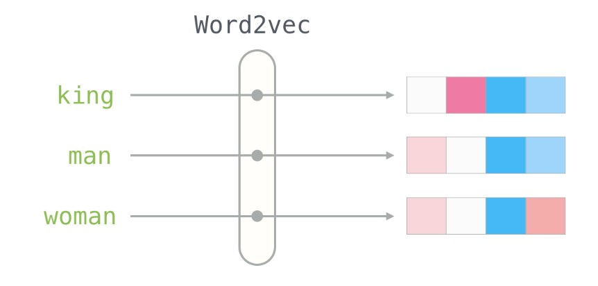

## Implementation of word2vec from scratch
---
This is a simple implementation of word2vec from scratch. The code is written in Python 3.6. The code is partially based on the following paper: **[Efficient Estimation of Word Representations in Vector Space](https://arxiv.org/abs/1301.3781)**



## Words embeddings
---
Word embeddings are a type of word representation that allows words with similar meaning to have a similar representation. The model learns to represent words in a way that words with similar meaning are represented by vectors that are close to each other in the vector space.

## Mathematical background
---
The word2vec model is a neural network model that learns word embeddings. The model is trained to predict the context of a word given a set of words. The context of a word is defined as the set of words that appear close to the target word in a text. The model is trained using a **skip-gram** architecture. There are two different architectures for training word2vec models: **skip-gram** and **continuous bag of words** (CBOW).

```python
def generate_training_data()
```
This function generates the training data. Primary purpose of this function is to generate the training data for the skip-gram model. It implements the following.
- Preprocess the text sentence.
- Split the text sentence into words and create lookup dictionaries of words and indices.
```python
self.word2id={"word in sentence":index of the word}
self.id2word={index of the word:"word in sentence"}
```
- Create a corpus of words which is a list of all the words in the text sentence.
```python 
corpus=["word1","word2","word3",...]
```
- Convert the target word to one-hot encoded vector.
- Cycle through context window and create a training sample for each target word.

```python
def one_hot_encode()
```
- Converts the target word to one-hot encoded vector.

```python
def train()
```
- Randomly initialize the weights of the neural network.
- Cycle through each training sample and perform forward and backward propagation.
- Update the weights after each iteration.
- Calculate loss after each iteration.

```python
def forward_pass()
```
- Starting with the first epoch, the forward pass calculates the dot product of the input word vector and the hidden layer weights. This is then passed through the softmax function to get the output word vector.

```python
def softmax()
```
- The softmax function is used to calculate the probability distribution of the output word vector. The output word vector is a one-hot encoded vector with the index of the target word set to 1 and the rest of the indices set to 0. The softmax function calculates the probability of each word in the vocabulary being the target word.

```python
def backprop()
```
- The backpropagation function calculates the gradients of the loss function with respect to the weights of the neural network. The gradients are then used to update the weights of the neural network.

```python
def word_vec()
```
- This function returns the word vector for a given word.

```python
def vec_similarity()
```
- This function calculates the cosine similarity between two word vectors.

> For better understanding of the algorithm and calculations , please refer to this awesome blog by Jay Alammar: [Illustrated Word2Vec](https://jalammar.github.io/illustrated-word2vec/)
